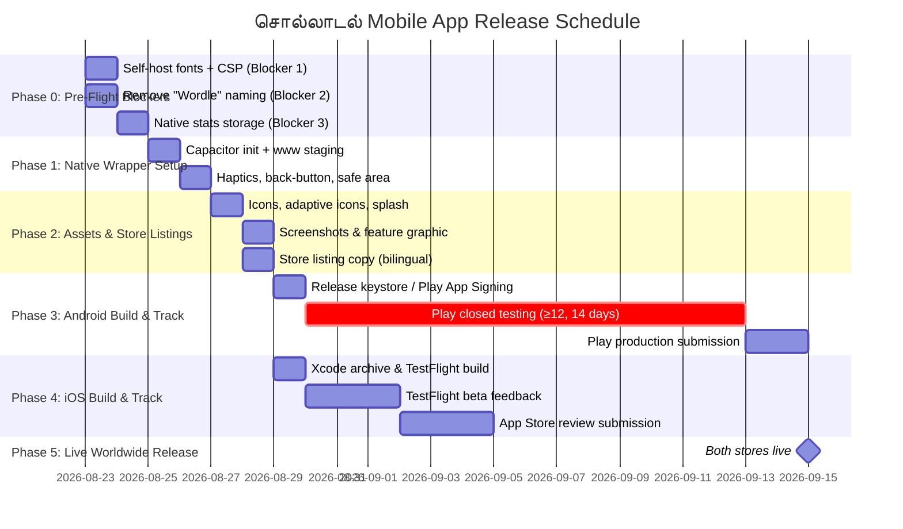

# சொல்லாடல் (Solladal) — Mobile App Publishing Plan
### Complete End-to-End Store Release Guide for Apple App Store (iOS) & Google Play Store (Android)
**Publisher / Organization:** `deetech.org` • **Bundle Identifier:** `org.deetech.solladal`

---

## 1. Executive Summary & Architectural Paths

**சொல்லாடல் (Solladal)** is designed as an educational, authentic Tamil word-guessing game tailored for Grade 1 to 5 students and Tamil learners worldwide. Following the architectural standards established in the `deetech.org` ecosystem (such as `townsquare`), this plan provides two production-grade pathways to publish on iOS and Android:

```
                                  ┌─────────────────────────────────────────────────────────┐
                                  │         சொல்லாடல் (Solladal) Word-Game Core            │
                                  │   (1,500 Words, 2-Step Keypad, 3 Clues, Polished CSS)  │
                                  └────────────────────────────┬────────────────────────────┘
                                                               │
                                ┌──────────────────────────────┴──────────────────────────────┐
                                │                                                             │
                  ▼ Path A (Fastest to Store)                                   ▼ Path B (EAS Ecosystem)
     ┌───────────────────────────────────────────┐                 ┌───────────────────────────────────────────┐
     │           Capacitor Native Bridge         │                 │       Expo + EAS Build & EAS Update       │
     ├───────────────────────────────────────────┤                 ├───────────────────────────────────────────┤
     │ • Wraps existing Vanilla JS & CSS         │                 │ • React Native / Expo UI components       │
     │ • Zero code rewrite                       │                 │ • Shares EAS Project & Org Config         │
     │ • 100% offline local binary               │                 │ • Over-The-Air (OTA) updates via `eas`    │
     │ • Native Haptics & Share plugins          │                 │ • Unified with Townsquare mobile tooling  │
     └───────────────────────────────────────────┘                 └───────────────────────────────────────────┘
```

### Comparative Analysis

| Dimension | Path A: Capacitor Native Bridge (Recommended for v1.0) | Path B: Expo / React Native (Townsquare Standard) |
| :--- | :--- | :--- |
| **Code Reuse** | **100%** (Uses existing `index.html`, `js/`, `css/`, `data/words.json`) | Reuses algorithms & datasets; UI ported to React Native |
| **Time to Store** | **1 – 2 days** | **1 – 2 weeks** |
| **OTA Updates** | Capacitor Live Updates / App Store releases | **EAS Update (`expo-updates`)** via `eas update` |
| **Offline Performance** | Instant cold start (bundled local assets) | Instant cold start (bundled local Hermes JS) |
| **Haptics & Native APIs** | `@capacitor/haptics`, `@capacitor/share` | `expo-haptics`, `expo-sharing` |
| **Target Audience** | Mobile iOS & Android | Mobile iOS & Android |

---

## 1.1. Critical Pre-Flight Fixes (Do These First — They Are Release Blockers)

These three items must be resolved **before** the first native build. Each one, left unfixed, either breaks a core marketing claim or risks store rejection.

### 🔴 Blocker 1 — Self-host the fonts (offline + privacy correctness)
`index.html` currently pulls **Noto Sans Tamil** and **Mukta Malar** from `fonts.googleapis.com` / `fonts.gstatic.com` at runtime. This silently breaks two of this app's headline promises:
- **"100% offline"** is false — with no network the fonts fail and the carefully-tuned Tamil typography falls back to system glyphs (diacritic clipping, inconsistent rendering).
- **"Collects nothing / no data shared / COPPA-safe"** is false — every launch sends the user's IP address to Google, a third party. Under Google Play's **Designed for Families** policy this is a reportable data transfer and a likely rejection.

**Fix:** download the two font families as `woff2`, place them in `assets/fonts/`, declare them with local `@font-face` rules, remove the three `<link>` tags from `index.html`, and add the font files to both `sw.js` `ASSETS_TO_CACHE` and the native bundle. Then add a Content-Security-Policy meta tag that forbids any external origin, so the "zero network requests" claim is provably true:
```html
<meta http-equiv="Content-Security-Policy"
      content="default-src 'self'; img-src 'self' data:; style-src 'self' 'unsafe-inline'; font-src 'self'; connect-src 'self'; script-src 'self'">
```

### 🔴 Blocker 2 — Avoid the "Wordle" trademark in store-facing names
"Wordle" is a registered trademark of **The New York Times Company**, which has actively pursued clones. Apple and Google have both rejected apps using "Wordle" in the **name, subtitle, or keywords**. Describing the *gameplay* as "word-guessing" is fine; using the word "Wordle" as a brand is the risk. This plan's listings below have been revised to lead with **"Solladal — Tamil Word Game"** and drop "Wordle" from names and keywords. Keep "Solladal" and "Tamil word game/puzzle" as the brand.

### 🟠 Blocker 3 — Durable stats on iOS (`localStorage` caveat)
`js/storage.js` persists streaks and stats via `localStorage`. Inside iOS `WKWebView`, WebKit may **evict** localStorage under storage pressure, silently wiping a child's streak. Migrate persistence to **`@capacitor/preferences`** (Path A) / **`expo-secure-store` or `AsyncStorage`** (Path B), keeping localStorage only as the web fallback. Wrap it behind the existing `StorageManager` so the game code is untouched.

---

## 2. Global App Metadata & Identifiers

### Identifiers (Aligned with `deetech.org`)
- **App Name (Tamil):** `சொல்லாடல்`
- **App Name (English):** `Solladal - Tamil Word Game`
- **Bundle ID (iOS):** `org.deetech.solladal`
- **Package Name (Android):** `org.deetech.solladal`
- **Marketing Version:** `1.0.0`
- **Initial Build Number:** `1` (`versionCode: 1` / `buildNumber: "1"`)
- **Primary Category:** Games / Word
- **Secondary Category:** Education / Puzzle
- **Content Rating:** Everyone (PEGI 3, ESRB E, iOS 4+) — Family & COPPA Compliant

---

## 3. Store Listings & ASO Metadata

### A. Apple App Store (iOS)

| Attribute | Specification | Content |
| :--- | :---: | :--- |
| **App Name** | Max 30 chars | `சொல்லாடல் - Tamil Word Game` |
| **Subtitle** | Max 30 chars | `தமிழ் சொல் விளையாட்டு & புதிர்` |
| **Promotional Text** | Max 170 chars | `1,500 தமிழ் சொற்கள், 3 கல்விசார் குறிப்புகள் மற்றும் புதுமையான 2-வழி தமிழ் விசைப்பலகையுடன் தமிழ் சொல் புதிர் விளையாட்டை விளையாடுங்கள்!` |
| **Keywords** | Max 100 chars | `tamil,solladal,சொல்லாடல்,tamilwords,learntamil,wordgame,thirukkural,puzzle,kids,education,vocabulary` |

> **ASO tip:** Apple counts spaces in the 100-char keyword field — use commas only, no spaces (as above), to fit more terms. Do not repeat words already in the App Name/Subtitle; Apple indexes those separately. "Wordle" is intentionally omitted from all names and keywords (see Blocker 2).
| **Support URL** | URL | `https://deetech.org/solladal/support` |
| **Marketing URL** | URL | `https://deetech.org/solladal` |
| **Privacy URL** | URL | `https://deetech.org/solladal/privacy.html` |
| **Non-Exempt Encryption** | Info.plist | `ITSAppUsesNonExemptEncryption: false` (No custom crypto) |

### B. Google Play Store (Android)

| Attribute | Specification | Content |
| :--- | :---: | :--- |
| **App Title** | Max 30 chars | `சொல்லாடல்: Tamil Word Game` |
| **Short Description** | Max 80 chars | `1-5 எழுத்து தமிழ் சொல் புதிர் விளையாட்டு. 1,500 சொற்கள் & 3 குறிப்புகள்!` |
| **Full Description** | Max 4000 chars | *(See Section 3.C below)* |
| **Target Audience** | Family Policy | Ages 6-8, 9-12, and 13+ (Designed for Families) |
| **Data Safety** | Form | **No data collected, No data shared, No tracking, No ads** |

### C. Bilingual Full Store Description

```text
சொல்லாடல் (Solladal) — தமிழ் மொழி ஆர்வலர்களுக்கும், பள்ளி மாணவர்களுக்கும் ஏற்ற முழுமையான தமிழ் சொல் புதிர் விளையாட்டு!

Solladal is an elegant, authentic, and educational Tamil Word Guessing Game crafted for Grade 1 through Grade 5 learners, families, and Tamil enthusiasts worldwide.

🌟 சிறப்பு அம்சங்கள் (Key Features):

• 1,500 தரப்படுத்தப்பட்ட தமிழ் சொற்கள் (1,500 Curated Words):
  - 1-எழுத்து ஓரெழுத்து ஒருமொழி (100 சொற்கள்)
  - 2-எழுத்து சொற்கள் (200 சொற்கள்)
  - 3-எழுத்து சொற்கள் (300 சொற்கள்)
  - 4-எழுத்து சொற்கள் (400 சொற்கள்)
  - 5-எழுத்து சொற்கள் (500 சொற்கள்)

• எண்கள், மாதங்கள், ராசிகள் & நட்சத்திரங்கள் (Special Categories):
  தமிழ் எண்கள் (1-10, 100, 1000), 12 தமிழ் மாதங்கள், 12 ராசிகள் மற்றும் 27 நட்சத்திரங்கள் அனைத்தும் விளையாட்டில் சேர்க்கப்பட்டுள்ளன!

• புதுமையான 2-படி தமிழ் விசைப்பலகை (Innovative 2-Step Keypad):
  மெய் எழுத்து + உயிர் எழுத்து = உயிர்மெய் எழுத்து (எ.கா: [க்] + [ஆ] = [கா]). தமிழ் எழுத்துக்களை எளிதாக உருவாக்கலாம்.

• 3 அடுக்கு பயனுள்ள குறிப்புகள் (3 Progressive Educational Clues):
  1. பொருள் குறிப்பு (Definition & Meaning - உடனே திறக்கும்)
  2. இலக்கியக் குறிப்பு (Thirukkural, Aathichoodi, Sangam context - 4வது முயற்சியில்)
  3. விடுகதை / பயன்பாட்டுக் குறிப்பு (Riddle & Usage - 5வது முயற்சியில்)

• 100% ஆஃப்லைன் வசதி (Fully Offline):
  இணைய இணைப்பு இல்லாமலும் எங்கும் எப்போதும் விளையாடலாம்.

• முழுமையான பாதுகாப்பு & தனியுரிமை (Private & Child-Safe):
  விளம்பரங்கள் இல்லை, தனிநபர் தரவு சேகரிப்பு இல்லை, கணக்கு தொடங்க வேண்டிய அவசியமில்லை.

Learn vocabulary, solve cultural riddles, and master Tamil letters daily with சொல்லாடல் (Solladal)!
```

---

## 4. Privacy Policy & Compliance (COPPA & Family Policy)

Mirroring `deetech.org`'s strict privacy standard in `townsquare/PRIVACY.md`, create a dedicated `PRIVACY.md` for Solladal:

```markdown
# Privacy Policy — சொல்லாடல் (Solladal)

**App:** சொல்லாடல் (Solladal)  
**Owner:** deetech.org  
**Effective Date:** 2026-08-22  

## Summary
**சொல்லாடல் (Solladal) collects nothing.** It has no accounts, no servers, no analytics, no advertising SDKs, and makes zero network requests. The entire 1,500-word bank and gameplay logic run 100% locally on your device.

> ⚠️ This "zero network requests" statement is only true after **Blocker 1** (self-hosting the fonts) is completed. Do not publish this policy or submit the Play "Data Safety" / App Store "Privacy" forms until the runtime Google Fonts fetch has been removed and the CSP is in place — otherwise the app leaks the user's IP to Google on every launch and the statement is false.

## Data Storage
- Game statistics (win streaks, games played, guess distribution histogram) are stored **strictly on your local device** using LocalStorage / OS sandbox storage.
- No personal information, device identifiers, or usage logs ever leave your device.

## Children's Privacy (COPPA Compliance)
Because the app collects no data whatsoever from any user, it collects no data from children under 13.

## Contact
Questions regarding this policy: contact@deetech.org
```

---

## 5. Visual Asset Specifications

Following Townsquare's asset configuration in `app.json`:

```
assets/
└── mobile/
    ├── icon-ios-1024x1024.png          # App Store Icon (Square, No Alpha, 1024x1024)
    ├── android-icon-foreground.png     # Android Adaptive Icon Foreground (512x512 with transparency)
    ├── android-icon-background.png     # Android Adaptive Icon Background (512x512 solid #D97706)
    ├── android-icon-monochrome.png     # Android 13+ Themed Icon (512x512)
    ├── splash-logo.png                 # Centerpiece logo for splash screen (400x400)
    ├── play-store-feature-1024x500.png # Google Play Feature Graphic (1024x500)
    └── screenshots/
        ├── ios-6.9-iphone16promax/     # 1320 x 2868 px (Portrait) — required baseline
        ├── ios-6.7-iphone15promax/     # 1290 x 2796 px (Portrait) — optional/legacy
        ├── ios-13-ipadpro/             # 2064 x 2752 px (Portrait) — required if "supportsTablet"
        └── android-phone/              # 1080 x 2400 px (Portrait, 2-8 screens)
```

---

## 6. Implementation Guide: Path A (Capacitor Native Bridge)

### Step 1: Package & Plugin Setup

```bash
# 1. Install Capacitor core dependencies
npm install @capacitor/core @capacitor/cli @capacitor/ios @capacitor/android

# 2. Install Native Plugins (Haptics, Share, StatusBar, SplashScreen, App, Preferences)
npm install @capacitor/haptics @capacitor/share @capacitor/status-bar @capacitor/splash-screen @capacitor/app @capacitor/preferences

# 3. Install icon/splash generator (dev only)
npm install -D @capacitor/assets

# 4. Initialize Capacitor (webDir is a dedicated build folder, NOT the repo root)
npx cap init "Solladal" "org.deetech.solladal" --web-dir "www"
```

> **Why `www`, not `.`:** Capacitor copies the *entire* `webDir` into each native project. Pointing it at the repo root would bundle `.git/`, `scripts/`, the 1.2 MB `tamilwordbank.md`, and this plan into the shipped app. Add a tiny copy step that stages only the runtime assets:
> ```jsonc
> // package.json  →  "scripts"
> "prep:mobile": "node -e \"const {cpSync,rmSync,mkdirSync}=require('fs');rmSync('www',{recursive:true,force:true});mkdirSync('www');for(const p of ['index.html','manifest.json','css','js','data','assets']) cpSync(p,'www/'+p,{recursive:true});\""
> ```
> Run `npm run prep:mobile && npx cap sync` before every build. (The PWA still serves from the repo root for the web target.) Generate icons/splash from a source image with `npx capacitor-assets generate`.

### Step 2: `capacitor.config.json` Configuration

```json
{
  "appId": "org.deetech.solladal",
  "appName": "சொல்லாடல்",
  "webDir": "www",
  "backgroundColor": "#FAF7F2",
  "ios": {
    "contentInset": "always",
    "preferredContentMode": "mobile",
    "scheme": "Solladal"
  },
  "android": {
    "backgroundColor": "#FAF7F2",
    "allowMixedContent": false,
    "captureInput": true
  },
  "plugins": {
    "SplashScreen": {
      "launchShowDuration": 1500,
      "launchAutoHide": true,
      "backgroundColor": "#D97706",
      "androidSplashResourceName": "splash",
      "showSpinner": false,
      "splashFullScreen": true,
      "splashImmersive": true
    },
    "StatusBar": {
      "style": "DARK",
      "backgroundColor": "#D97706"
    }
  }
}
```

### Step 3: Native Enhancements in Code

1. **Safe Area CSS (`css/style.css`)**:
   ```css
   body {
     padding-top: env(safe-area-inset-top);
     padding-bottom: env(safe-area-inset-bottom);
     padding-left: env(safe-area-inset-left);
     padding-right: env(safe-area-inset-right);
     user-select: none;
     -webkit-user-select: none;
     -webkit-touch-callout: none;
   }
   ```

2. **Native Haptic Feedback (`js/gameEngine.js` & `js/app.js`)**:
   > Note: with no bundler, `ImpactStyle` / `NotificationType` are **not** on `window.Capacitor.Plugins` — those enums are exports of the `@capacitor/haptics` module. Their values are plain strings, so pass the string literals directly. Wrap every call in `try/catch`; haptics rejects on unsupported devices.
   ```javascript
   async function playHaptic(style = 'light') {
     try {
       if (window.Capacitor?.isPluginAvailable?.('Haptics')) {
         const { Haptics } = window.Capacitor.Plugins;
         if (style === 'light')       await Haptics.impact({ style: 'LIGHT' });
         else if (style === 'medium') await Haptics.impact({ style: 'MEDIUM' });
         else if (style === 'success') await Haptics.notification({ type: 'SUCCESS' });
         else if (style === 'error')   await Haptics.notification({ type: 'ERROR' });
         return;
       }
     } catch (e) { /* fall through to web vibrate */ }
     if (navigator.vibrate) navigator.vibrate(style === 'light' ? 15 : 30);
   }
   ```

3. **Android hardware back button (`js/app.js`)** — without this, pressing Back mid-game exits the app straight to the home screen (a common review complaint and a poor experience for kids):
   ```javascript
   if (window.Capacitor?.isPluginAvailable?.('App')) {
     const { App } = window.Capacitor.Plugins;
     App.addListener('backButton', ({ canGoBack }) => {
       if (isModalOpen()) closeModal();          // close a modal first
       else App.exitApp();                        // only exit from the home screen
     });
   }
   ```

4. **Durable stats (`js/storage.js`)** — swap the localStorage read/write for `@capacitor/preferences` when running natively, keeping localStorage as the web fallback (see Blocker 3):
   ```javascript
   const P = window.Capacitor?.Plugins?.Preferences;
   async function saveStats(stats) {
     const json = JSON.stringify(stats);
     if (P) await P.set({ key: 'solladal_stats', value: json });
     else localStorage.setItem('solladal_stats', json);
   }
   ```

5. **Native Share Dialog (`js/uiController.js`)**:
   ```javascript
   async function shareScore(scoreText) {
     if (window.Capacitor && window.Capacitor.isPluginAvailable('Share')) {
       const { Share } = window.Capacitor.Plugins;
       await Share.share({
         title: 'சொல்லாடல் (Solladal)',
         text: scoreText,
         dialogTitle: 'Share your Solladal score'
       });
     } else if (navigator.share) {
       await navigator.share({ text: scoreText });
     } else {
       await navigator.clipboard.writeText(scoreText);
       showToast("முடிவுகள் நகலெடுக்கப்பட்டன! (Copied)");
     }
   }
   ```

---

## 7. Implementation Guide: Path B (Expo + EAS Build & EAS Update)

If configuring as an Expo project to mirror Townsquare's `eas.json` & `app.json` standard:

### `app.json`
```json
{
  "expo": {
    "name": "சொல்லாடல்",
    "slug": "solladal",
    "version": "1.0.0",
    "orientation": "portrait",
    "icon": "./assets/mobile/icon-ios-1024x1024.png",
    "userInterfaceStyle": "light",
    "updates": {
      "url": "https://u.expo.dev/YOUR-EAS-PROJECT-ID"
    },
    "runtimeVersion": {
      "policy": "appVersion"
    },
    "ios": {
      "supportsTablet": true,
      "bundleIdentifier": "org.deetech.solladal",
      "infoPlist": {
        "ITSAppUsesNonExemptEncryption": false
      }
    },
    "android": {
      "package": "org.deetech.solladal",
      "adaptiveIcon": {
        "backgroundColor": "#D97706",
        "foregroundImage": "./assets/mobile/android-icon-foreground.png",
        "backgroundImage": "./assets/mobile/android-icon-background.png",
        "monochromeImage": "./assets/mobile/android-icon-monochrome.png"
      },
      "predictiveBackGestureEnabled": false
    },
    "splash": {
      "image": "./assets/mobile/splash-logo.png",
      "resizeMode": "contain",
      "backgroundColor": "#D97706"
    }
  }
}
```

### `eas.json` (Townsquare Standard)
```json
{
  "cli": {
    "appVersionSource": "remote"
  },
  "build": {
    "development": {
      "developmentClient": true,
      "distribution": "internal"
    },
    "preview": {
      "distribution": "internal",
      "channel": "preview"
    },
    "production": {
      "channel": "production",
      "autoIncrement": true
    }
  }
}
```

### Post-Launch OTA Updates with EAS:
```bash
# Push instant vocabulary or clue updates Over-The-Air to all users without app store review:
eas update --channel production --message "Sync updated Tamil word bank clues"
```

---

## 8. Store Submission & Review Checklists

> Checkboxes are unchecked because nothing is done yet — tick them as you complete each item. The three pre-flight blockers (§1.1) gate everything below.

### Pre-flight (blockers — must clear first)
- [ ] **Fonts self-hosted** and runtime Google Fonts `<link>`s removed; CSP added (Blocker 1).
- [ ] **No "Wordle"** in app name, subtitle, keywords, or screenshots (Blocker 2).
- [ ] **Stats persistence** migrated to native storage (Blocker 3).
- [ ] `python scripts/sync_wordbank.py` run clean; `data/words.json` current and bundled.

### Apple App Store Connect Checklist
- [ ] **Account:** Apple Developer Program (`deetech.org`).
- [ ] **App ID:** `org.deetech.solladal` with no special entitlements needed.
- [ ] **Guideline 4.2 (Minimum Functionality):** Full offline capability with 1,500 words, rich 3-level clues, native haptic feedback, 2-step keypad synthesizer.
- [ ] **Guideline 4.3 (Spam/duplicates):** Word games get scrutiny — lead the listing with the educational Tamil-literacy angle (Grades 1–5, Thirukkural/Aathichoodi clues, grapheme keypad) to show original value.
- [ ] **Guideline 5.1.1 (Privacy):** Privacy "Nutrition Label" marked "Data Not Collected"; a public Privacy URL is required even when nothing is collected.
- [ ] **Kids Category (optional):** If listing under Kids, no third-party analytics/ads are allowed and a privacy policy is mandatory — this app already qualifies.
- [ ] **Encryption:** `ITSAppUsesNonExemptEncryption` set to `false`.
- [ ] **TestFlight:** Upload archive from Xcode or EAS Build → complete internal beta testing.

### Google Play Console Checklist
- [ ] **Account:** Google Play Developer Account (`deetech.org`).
- [ ] **Package:** `org.deetech.solladal`.
- [ ] **Target API Level:** meet Google's current minimum for new apps (Android 15 / API 35 as of late 2025 — confirm at submission).
- [ ] **App Bundle:** Signed `.aab`; enroll in **Play App Signing** (Google holds the upload/signing keys).
- [ ] **Families Policy:** "Designed for Families" requires the Data Safety form to show no data leaves the device — this is why Blocker 1 is mandatory before opting in.
- [ ] **Data Safety:** Form submitted stating "No data collected, no data shared" (accurate only post-Blocker 1).
- [ ] **Content rating (IARC) questionnaire** completed → expect "Everyone / PEGI 3".
- [ ] **Internal / Closed Testing:** New personal developer accounts must run **closed testing with ≥12 testers for 14 days** before production — budget for this in the timeline.

---

## 9. Launch Roadmap & Verification Plan

> Dates are illustrative. The critical-path constraint is **Google Play closed testing**: a new personal developer account must run closed testing with ≥12 opted-in testers for 14 continuous days before it can promote to production. On an established org account this requirement is relaxed. Plan the real launch date around whichever store gates you longest.



---

## 10. Verification & Test Commands

```bash
# 1. Sync & Validate Word Bank before Mobile Build
$env:PYTHONIOENCODING="utf-8"; python scripts/sync_wordbank.py

# 2. Run PWA Integration Test Suite
python scripts/test_pwa_integration.py

# 3. For Capacitor Build (stage www first — see §6 Step 1)
npm run prep:mobile   # copy runtime assets into ./www
npx cap sync
npx cap open ios      # Opens Xcode
npx cap open android  # Opens Android Studio

# 4. For EAS Build (if Path B is chosen)
eas build --platform all --profile production
```
